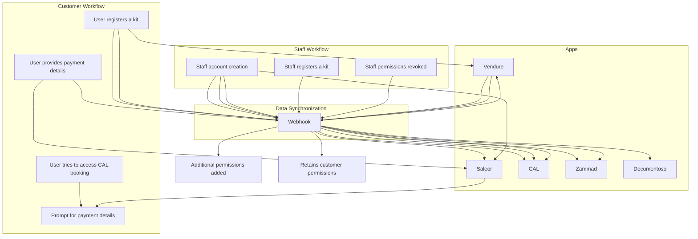

### Logic Description

1. **Customer Account Creation and Synchronization:**
   - **Saleor:** 
     - When users enter payment details during a purchase or authenticate payments to use **CAL** for appointment bookings, accounts are created in **Saleor** and **CAL**.
   - **Vendure & Zammad:**
     - When users register a kit, accounts are created in **Vendure** and **Zammad**.
     - If accounts are not already present in **Saleor** and **CAL**, the system creates accounts in these apps via **Vendure**.
   - **Payment Details Validation:** 
     - If users try to access bookings in **CAL** or make payments on **Saleor** without payment details, they are prompted to provide payment details.

2. **Staff Account Creation and Synchronization:**
   - Staff accounts are created in **Documentoso**, **Saleor**, **Zammad**, and **Vendure**.
   - Staff members who wish to purchase services must add payment details.
   - When staff register a kit, they gain additional permissions alongside their staff permissions.
   - If they stop being staff, their staff permissions are revoked, but they retain customer permissions.

3. **Webhook Logic:**
   - A webhook manages the flow of user data and account synchronization across all applications.
   - The webhook ensures that the appropriate apps are updated based on user actions (e.g., payment details, kit registration).

---

